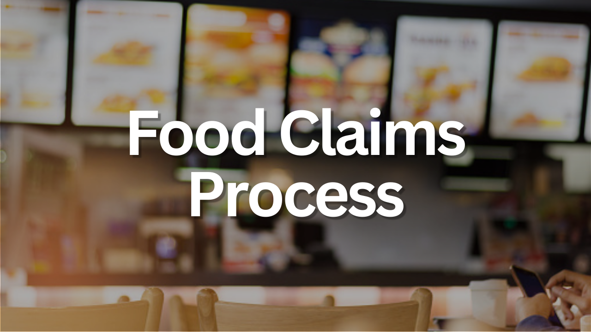

# Food Claims Process

**[Click here](https://github.com/jessicabohannon/Food-Claims/blob/main/notebook.ipynb)** to view my Food Claims Process Summary Report, which was a submission for my Data Analyst Associate Practical Exam. 

The project consisted of cleaning, visualizing, and analyzing a dataset for a legal team in order to help them improve the time it takes them to close claims.
This project showcases my proficiency in using Excel and Tableau to analyze and present data effectively, as well as communicating to stakeholders through reports.

Skills used:
* Cleaning data in Excel
* Visualizing data in Tableau
* Data Analysis
* Presenting findings in a Summary Report
